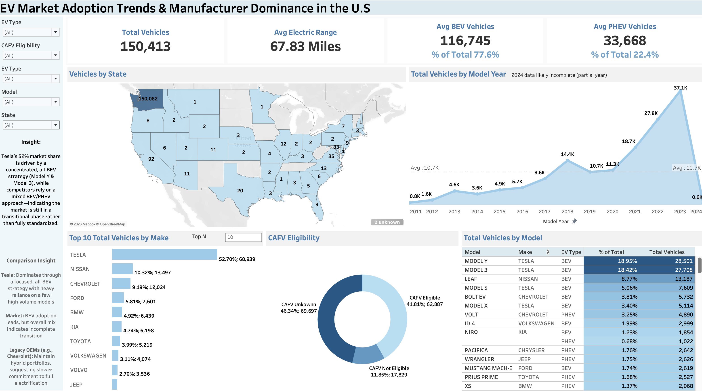
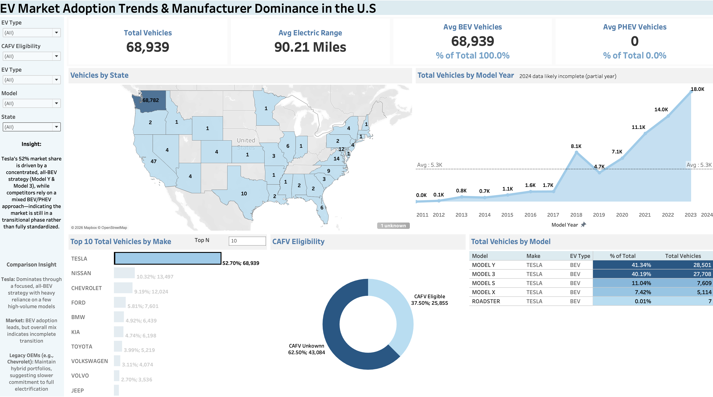

# EV Market Adoption Trends & Manufacturer Dominance (U.S.)

## 📌 Project Overview
This project analyzes electric vehicle (EV) adoption trends in the United States using a dataset of 150,000+ vehicle records. The goal is to understand how the EV market is evolving, identify key players, and evaluate differences in manufacturer strategies.

The analysis was conducted using Tableau to explore trends in vehicle adoption, market share, electric vehicle types (BEV vs PHEV), and geographic distribution.

This project is structured as a business-oriented analysis, focusing on answering key market and strategy questions rather than solely presenting visualizations.

---

## ❓ Key Questions
This project focuses on answering the following data-driven questions:

- How has EV adoption changed over time?
- Are Battery Electric Vehicles (BEVs) or Plug-in Hybrid Electric Vehicles (PHEVs) driving growth?
- Which manufacturers dominate the EV market?
- Do manufacturers follow different electrification strategies?
- How concentrated is the market by model and manufacturer?
- Are there geographic patterns in EV adoption?

---

## 📊 Dashboard Preview

[Interactive Dashboard](https://public.tableau.com/app/profile/omar.muniz/viz/ev_market_analysis/Dashboard1)
---

## 🔍 Focused Analysis Views

### Tesla (Pure BEV Strategy)

- 100% BEV adoption  
- Heavy concentration in Model Y and Model 3  

**Insight:**  
Tesla’s dominance is driven by a focused, all-electric strategy and reliance on a small number of high-volume models.

---

### Legacy Manufacturer Example: Chevrolet (Transitional Strategy)

- Mix of BEV and PHEV vehicles  
- Significant contribution from hybrid models like the Volt  

**Insight:**  
Legacy manufacturers maintain mixed portfolios, suggesting a slower transition toward full electrification.

---

### Strategic Comparison

**Insight:**  
Tesla’s concentrated BEV strategy contrasts with the broader market’s mixed approach—indicating the EV industry is still in a transitional phase rather than fully standardized.

---

## 📈 Key Findings

### EV Adoption Trends
- EV adoption accelerated significantly after 2018, with peak growth observed between 2021–2023  
- A sharp drop appears in 2024, likely due to incomplete (partial-year) data  

**Insight:**  
EV adoption is in a late-stage growth phase, indicating increasing consumer demand and improving infrastructure.

---

### BEV vs PHEV Adoption
- BEVs account for ~77.6% of total vehicles  
- PHEVs account for ~22.4%  

**Insight:**  
The market is shifting toward fully electric vehicles, while PHEVs remain a transitional solution.

---

### Manufacturer Dominance
- Tesla holds ~52% of total market share  
- Competitors such as Nissan and Chevrolet trail significantly  

**Insight:**  
The EV market is highly concentrated, with Tesla maintaining a dominant position.

---

### Model Concentration
- Tesla Model Y and Model 3 represent a large share of total vehicles  

**Insight:**  
Market success is driven by a small number of high-volume models rather than broad product portfolios.

---

### Manufacturer Strategy Comparison
- Tesla: Fully BEV-focused strategy  
- Market overall: BEV-dominant but still mixed  
- Legacy automakers (e.g., Chevrolet): Balanced BEV + PHEV approach  

**Insight:**  
Legacy manufacturers appear to be transitioning gradually, while Tesla is fully committed to electrification—indicating the market is not yet fully standardized.

---

### Geographic Distribution
- EV adoption is concentrated in a limited number of states  

**Insight:**  
Regional adoption is likely influenced by infrastructure availability, government incentives, and policy support.

---

## 🧠 Final Takeaways
- EV adoption is rapidly accelerating in the U.S.  
- BEVs are becoming the dominant vehicle type  
- Tesla leads due to a focused, high-volume BEV strategy  
- Legacy manufacturers are still transitioning toward full electrification  
- The EV market remains in a growth and transition phase  

---

## 📘 Key Metrics & Definitions

- **BEV (Battery Electric Vehicle):** Fully electric vehicle powered only by a battery  
- **PHEV (Plug-in Hybrid Electric Vehicle):** Vehicle that uses both electricity and gasoline  
- **CAFV Eligibility:** Indicates whether a vehicle qualifies for clean energy incentives  
- **Electric Range:** Maximum distance a vehicle can travel on electric power alone  
- **Market Share (%):** Percentage of total vehicles attributed to a manufacturer or model  
- **Model Year:** Year the vehicle model was released  

---

## 🛠 Tools Used
- Tableau (Data Visualization & Dashboarding)
- Excel (Data Cleaning)

---

## 📎 Notes
- 2024 data is likely incomplete and may not reflect full-year trends
